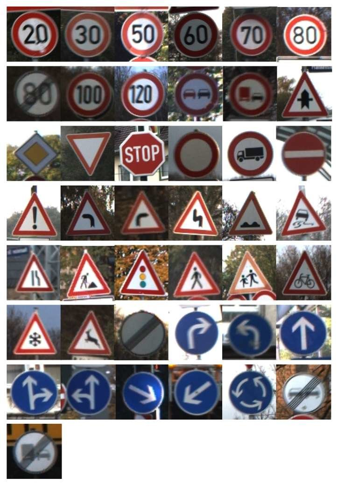

# TrafficSignRecognition_PyTorch

    

Traffic Sign Recognition on GTSRB dataset using PyTorch

Dataset link: https://www.kaggle.com/meowmeowmeowmeowmeow/gtsrb-german-traffic-sign

The model achieved 95.70% accuracy
